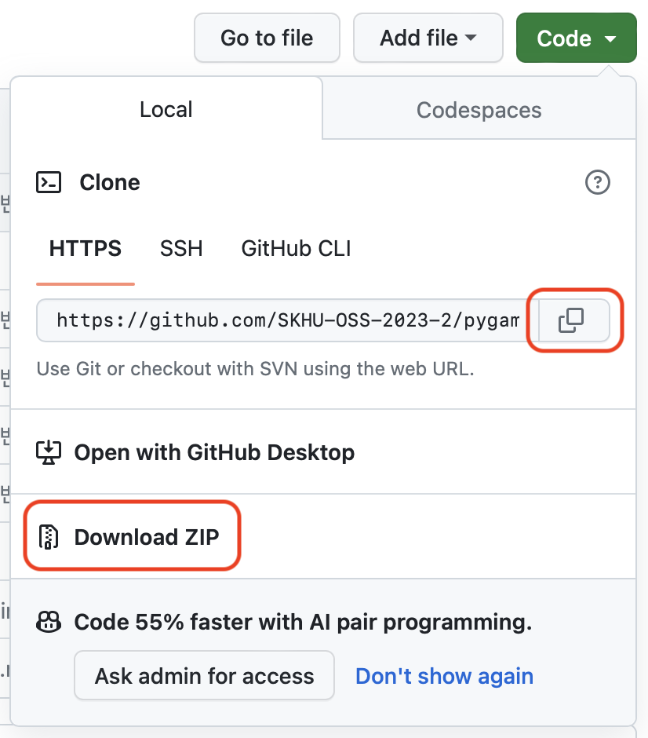

# 사천짬뽕 (SacheonJjambbong)
게임 <사천짬뽕>은 미니게임 천국의 여러 미니게임을 경험할 수 있는 포맷을 따온 게임 입니다.
<br>

#### 사용언어 
   
  <br><br>

> 🚨 현재(2023.11.27) 기준, 아직 게임을 합치는 과정이 끝나지 않아 G_avoid.py / G_Breaktheblock.py / G_memoryGame.py / G_snake.py 파일만 실행가능합니다. 
---
### 게임 실행을 위한 준비


1. 파일을 다운로드하거나 clone을 통해 파일을 열어줍니다.
<br>

  

  <br>
 
 2. **Pygame 라이브러리 설치 :** 터미널 또는 명령 프롬프트에서 다음 명령을 실행하여 Pygame 라이브러리를 설치합니다.

  ```
  pip install pygame
  ```  
  <br>

3. main.py를 실행시켜줍니다. (현재는 아직 완성되지 않아 main.py 대신 G_avoid.py / G_Breaktheblock.py / G_memoryGame.py / G_snake.py를 실행시켜주세요.)
<br>


___
### 1. 기억력 게임 :question:
#### 게임소개
> 뒤집어서 나온 카드의 모형을 기억하고 같은 도형을 찾아내는 게임입니다.

#### 게임방법
> 1. 게임 시작과 동시에 32장의 카드가 빠르게 뒤집히며 각 도형을 보여줍니다
> 2. 해당 카드의 모양을 기억하고 동일한 도형의 카드다 생각되는 카드를 클릭하며 자신의 기억력을 테스트 해보세요!

___

### 2. Snake game :question:
#### 게임소개
> 키보드를 사용하여 뱀을 조종해 먹이를 먹고 몸길이를 키우며 점수를 얻는 게임입니다.

#### 조작법
>방향키를 사용하여 플레이


>→ : 오른쪽으로 이동
← : 왼쪽으로 이동
↑ : 위로 이동
↓ : 아래로 이동


#### 점수 획득 방법
> 먹이를 먹으면 점수가 1점씩 오릅니다.


#### 게임 종료 :thumbsdown:
> 뱀이 컴퓨터 화면을 벗어났을 때
> 몸의 길이가 늘어나 자신의 몸과 부딪혔을 때 
이 두 경우의 상황에 게임이 종료되니, 이 점을 유의하여 게임을 시작해보세요!

___

### 3. 피하기 게임 :question:

#### 게임소개
> 하늘에서 떨어지는 빨간색 블록을 피하는 게임입니다.


#### 조작 방법
> 조작은 오른쪽/왼쪽 화살표를 이용하여 좌우로 움직일 수 있습니다.


#### 특징
> 블록을 1개 피할때마다 점수가 1점씩 상승합니다.
> 시간이 지남에 따라 떨어지는 블록의 갯수가 늘어나며, 속도 또한 빨라집니다.

___


### 4. 블럭 부수기


#### 게임 설명
> 패들을 조작하여 공을 튕겨서 블록을 파괴히여 점수를 휙득하는 게임 


#### 조작키
>우측 방향키: 오른쪽 이동  
좌측 방향키: 왼쪽 이동   
R키: 게임 종료시 다시시작   


#### 게임 TIP 
>공을 파괴할 블록 사이로 넣으면 블록들 사이에서 공이 튕겨서 한번에 많은 블록을 파괴할 수 있다!!!     
블록이 전부 파괴되면 바로 블록이 생성되는 점을 이용하면 많은 블록을 파괴할수도!!!   


#### 게임 세부 설정 
>기본 공 *SPEED* 15  
스테이지 1 증가시 공 *SPEED* 1씩 증가  
블록 1개 파괴시 스테이지 만큼 점수 휙득   
15개 블록 전부 파괴시 바로 다음 스테이지 블록 생성  


#### 추후 개발 전망 
>일시정지와 재게 기능 추가 예정  
R키를 게임 종료 전에도 다시 시작 가능하게 수정 예정 

<br>

___

#### 개발중인 사항
- [ ] 각각의 인게임을 main.py와 연결하기

[인게임 구현 관련 링크](https://www.youtube.com/watch?v=b_DkQrJxpck  


___
## Contributors


| [](https://github.com/chaelimee) | [](https://github.com/ParkJeonghyeon1013) | [](https://github.com/jwnamid) | [](https://github.com/jrbuckhyun) |
| :------------------------------------------------------------------------: | :--------------------------------------------------------------------------: | :-------------------------------------------------------------------------------: | :------------------------------------------------------------------------: |
|[chaelimee](https://github.com/chaelimee)<br>G_snake.py|        [ParkJeonghyeon1013](https://github.com/ParkJeonghyeon1013)<br>G_memoryGame.py|[jwnamid](https://github.com/jwnamid)<br>G_avoid.py|[jrbuckhyun](https://github.com/jrbuckhyun) <br>G_Breaktheblock.py    |

